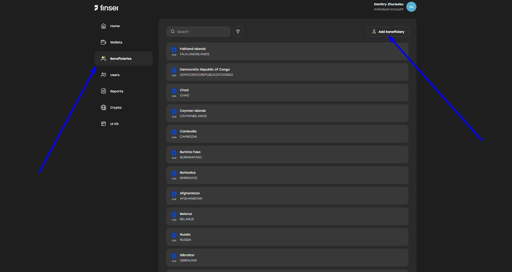
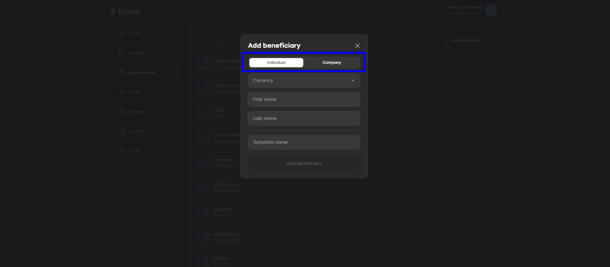
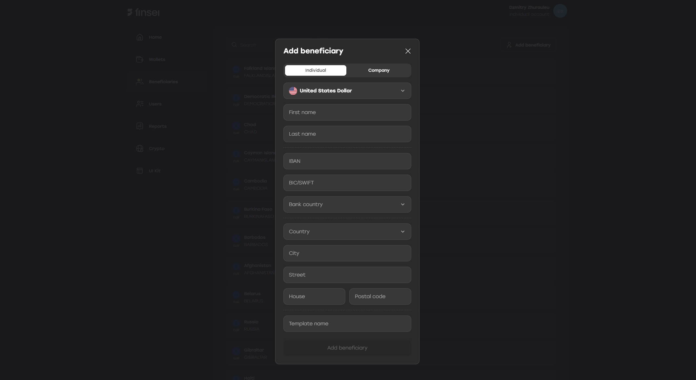
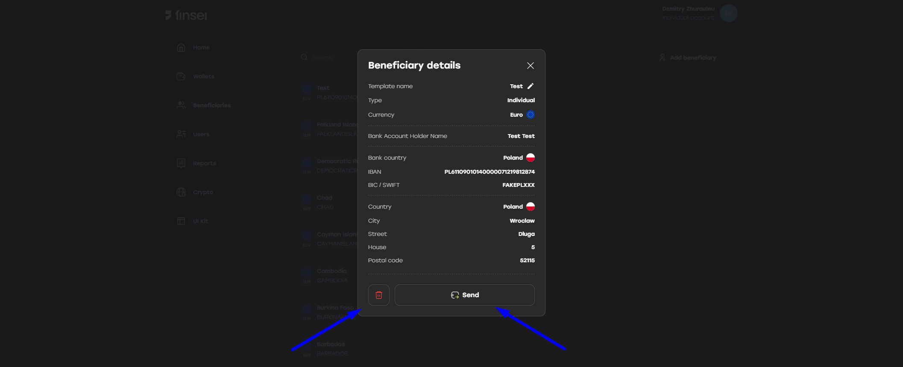
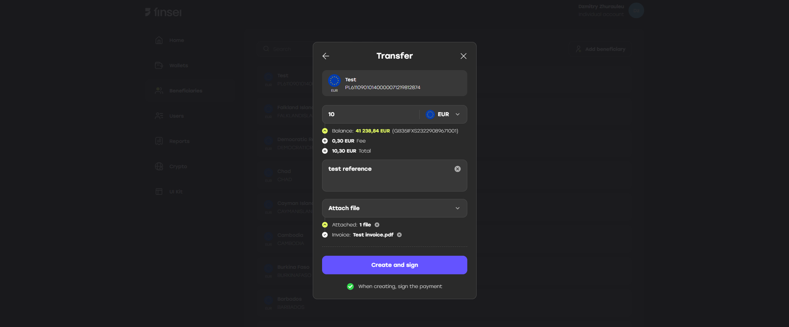
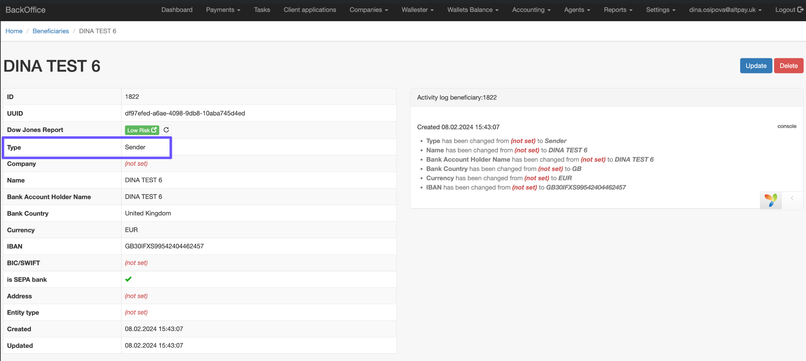

### Recipient Beneficiary Types

There are two types of recipient beneficiaries:

- Created by a company user based on the user’s own data  
- An existing Altpay customer

Company beneficiaries can be created and viewed on the **Beneficiary** tab in the frontend.

Beneficiaries can be of two types: **Individual** and **Company**.

If the user selects **USD** as the currency when creating a beneficiary, an additional section with fields to fill in appears.

After creating a beneficiary, the following actions are available:

- **Send (pay)**
- **Delete**

Beneficiary Payment Creation Form

A payment with the **New** status will appear on the **Dashboard**.

