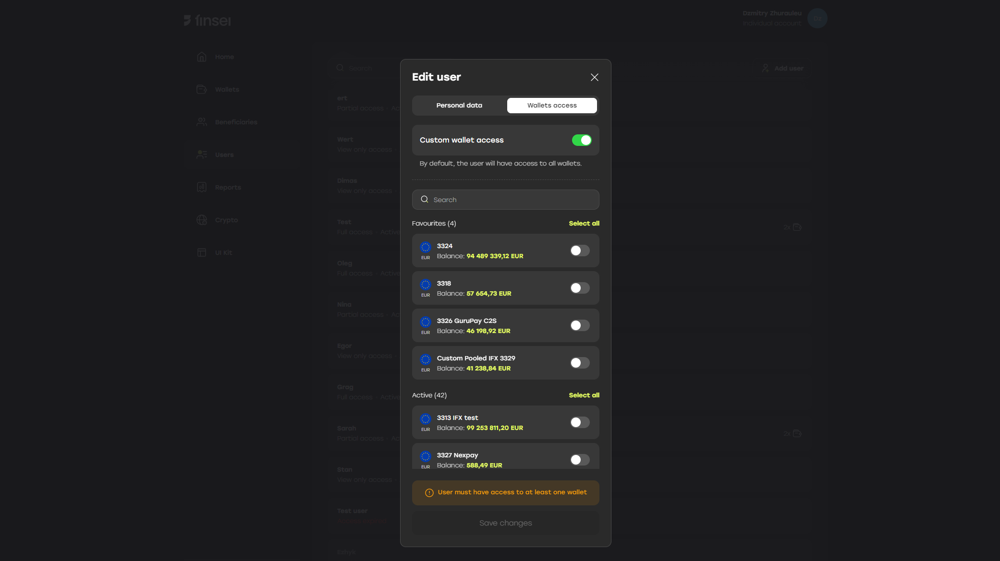
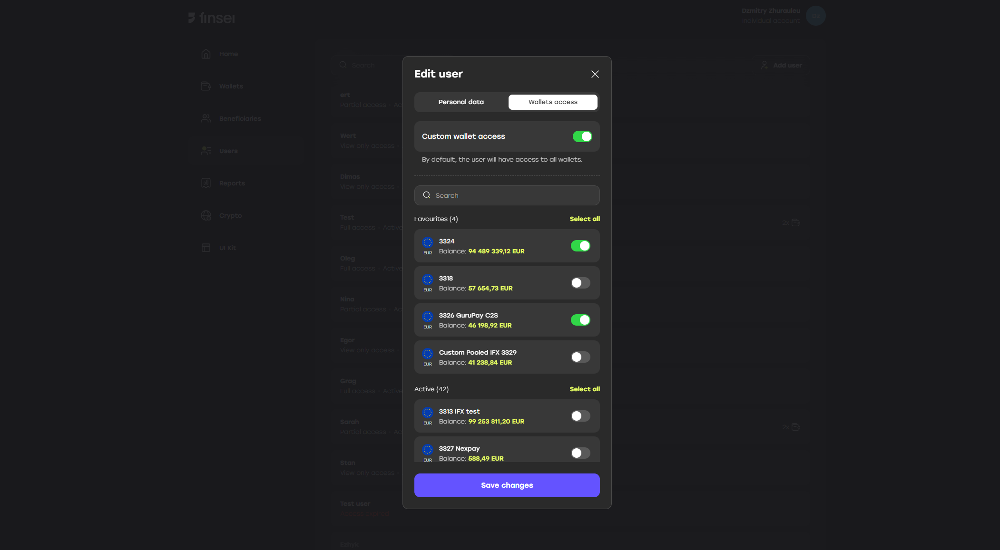

> The **Users** tab is only visible to the company’s **main user (admin)**.

### Role

User can have a role which limits user's actions.

There are three available roles for user:
- Full access
- Partial access
- View only access

### Expiration date

User can have limited by time access. 'Expire date' attribute should be specified, so user is only able to perform actions until specified date.

### Wallet access

When creating or editing a user, you can configure their access to specific company wallets — **wallet access**.

> If the **“Custom wallet access”** toggle is enabled, at least one wallet must be selected for the user to have access to.

Once the available wallets are selected, the user will only have access to the specified wallets and their associated transactions.

### Password setup

Once user is created, he should set password using 'Forgot password?' form on login page. After password set up, an email with reset password link will be received to the specified email address.

### JWT token

Users also can be used to create JWT token. More info you can find 
[here](/getting-started/create-jwt-token.mdx).