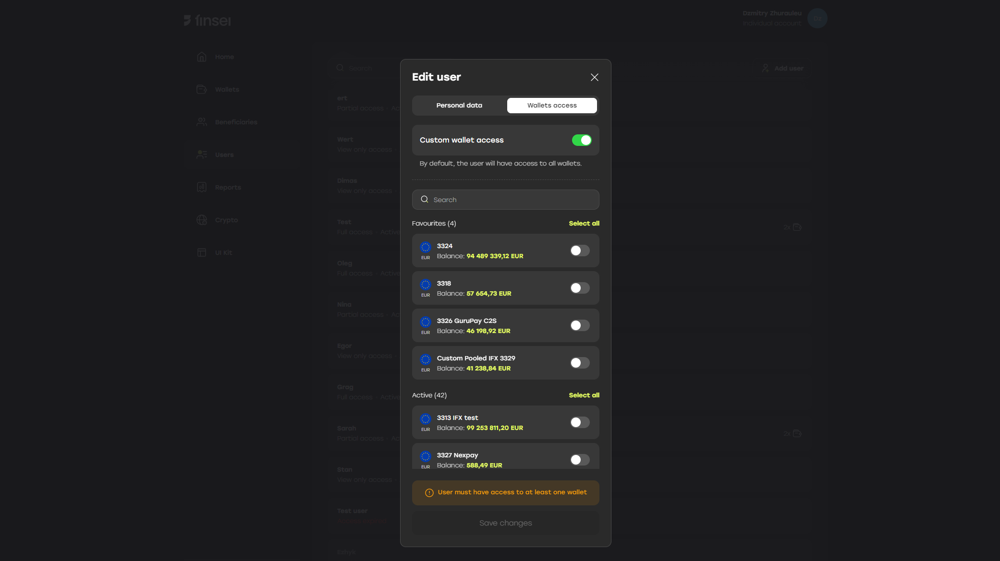
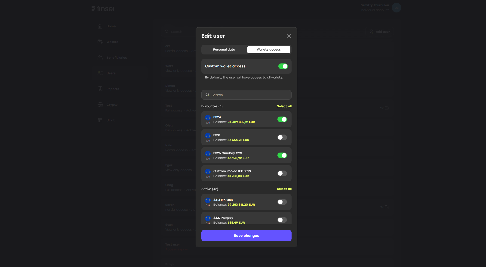
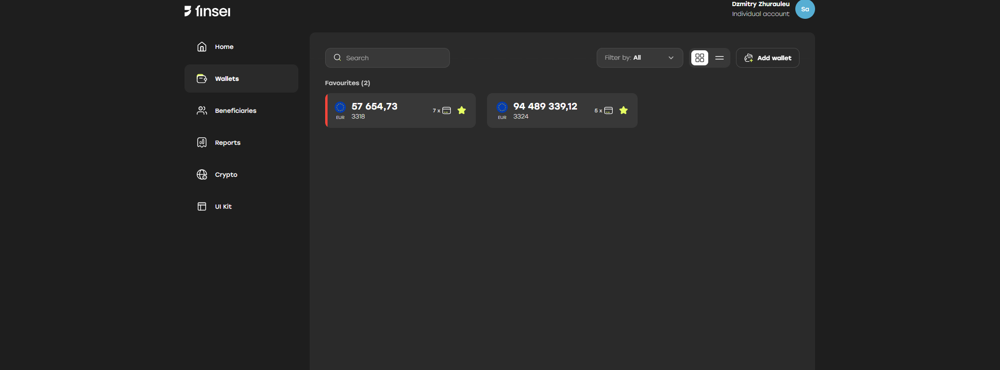

**Users** are individuals within a company who can perform various actions depending on their assigned role.

> The **Users** tab is visible only to the company’s **main user (admin)**.

When creating or editing a user, you can configure their access to specific company wallets — **wallet access**.

> If the **“Custom wallet access”** toggle is enabled, at least one wallet must be selected for the user to have access to.

Once the available wallets are selected, the user will only have access to the specified wallets and their associated transactions.

