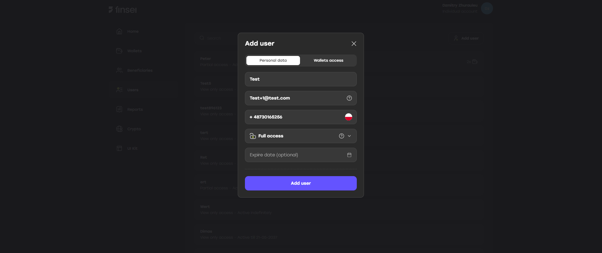

## To create a sub-user, follow the steps:

1. Log in as the main user to your account: [https://app.sandbox.finsei.com/auth/login](https://app.sandbox.finsei.com/auth/login)  
2. Go to the **Users** tab  
3. Click **Add user**  
4. Fill in all required fields  
5. Click **Add user**

To log in as a sub-user, a password must be set.  
Use the **"Forgot password"** form: [https://app.sandbox.finsei.com/auth/login](https://app.sandbox.finsei.com/auth/login).

