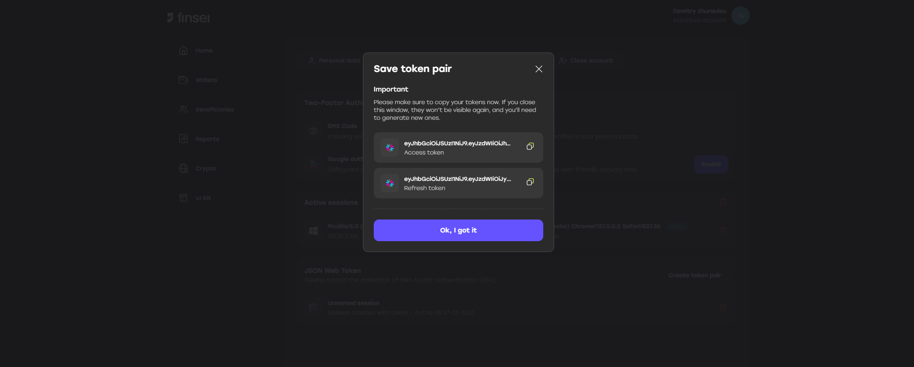

The following functionality can help you avoid an additional step when using the Finsei API - the **sign** API method.

JWT token creation is only available for sub-users.

To generate a JWT token without 2FA, follow the steps below and set the **"Enable 2FA"** parameter to `false`.

**Steps:**

1. Go to **Account > Settings**

2. Go to **Security** tab  
3. Click **"Create token pair"** under **"JSON Web Token"** section

4. Fill in all required fields:
   - **IP address** – address allowed for login  
   - **Expire date** – date when the token will expire  
   - **Session name** – name for the generated token pair  
   - **Enable 2FA** – whether 2FA is enabled or not

5. Click the **"Confirm"** button  
6. Enter the **2FA code**  
7. Save the generated **access** and **refresh** tokens

The tokens can be used to log in via API and to refresh the access token.

❗ **Please note:**

- If you don’t specify IP addresses, the tokens will expire in **3 months** - means no matter how many times you refresh your token during this time, in 3 mounth you won't be able to log in and to refresh your tokens
- The **access token** is valid for **10 minutes** and should be refreshed using  
  `POST /v2/auth/token/refresh` with the refresh token obtained in step 7
- The **refresh token** is valid until it is used
