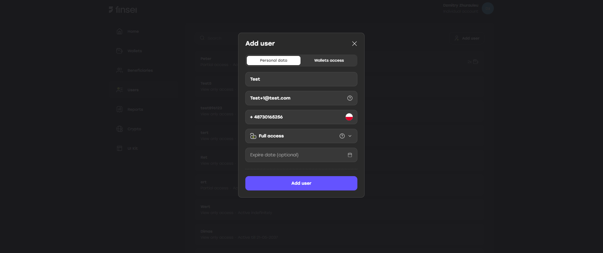

## To create a sub-user, follow the steps below:

1. Log in as the main user to your account: [https://app.sandbox.finsei.com/auth/login](https://app.sandbox.finsei.com/auth/login)  
2. Go to the **Users** tab  
3. Click **Add user**  
4. Fill in all required fields  
5. Click **Add user**

To log in as a sub-user, a password must be set.  
Use the **"Forgot password?"** form: [https://app.sandbox.finsei.com/auth/forgot](https://app.sandbox.finsei.com/auth/forgot).

After submitting the form, please reach out to <a href="mailto:dina.osipova@finsei.com">dina.osipova@finsei.com</a> to get the reset password link.

Once the password is set and confirmed, the sub-user can log in.